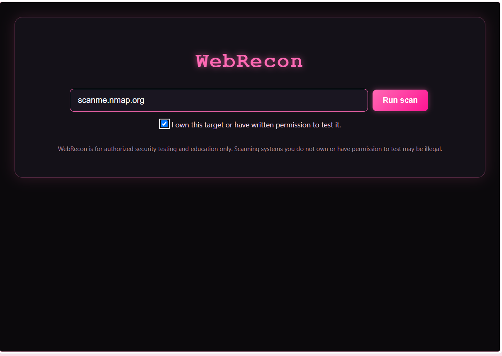
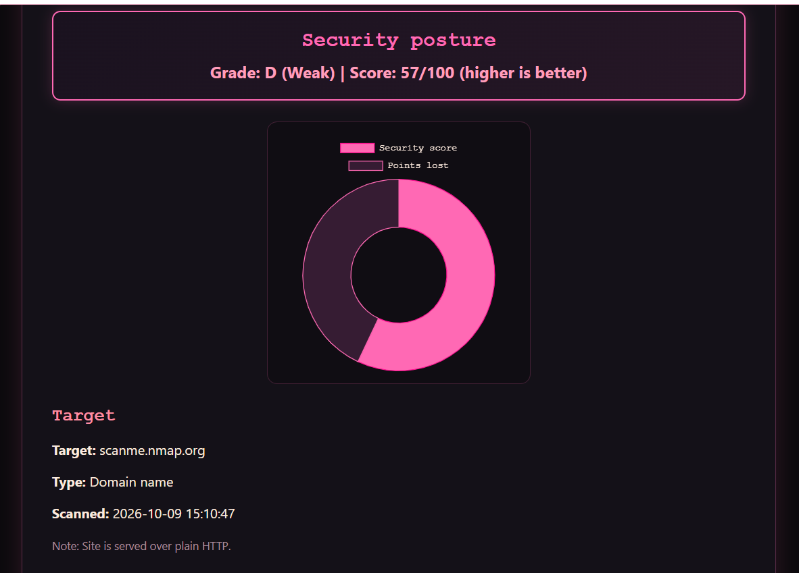
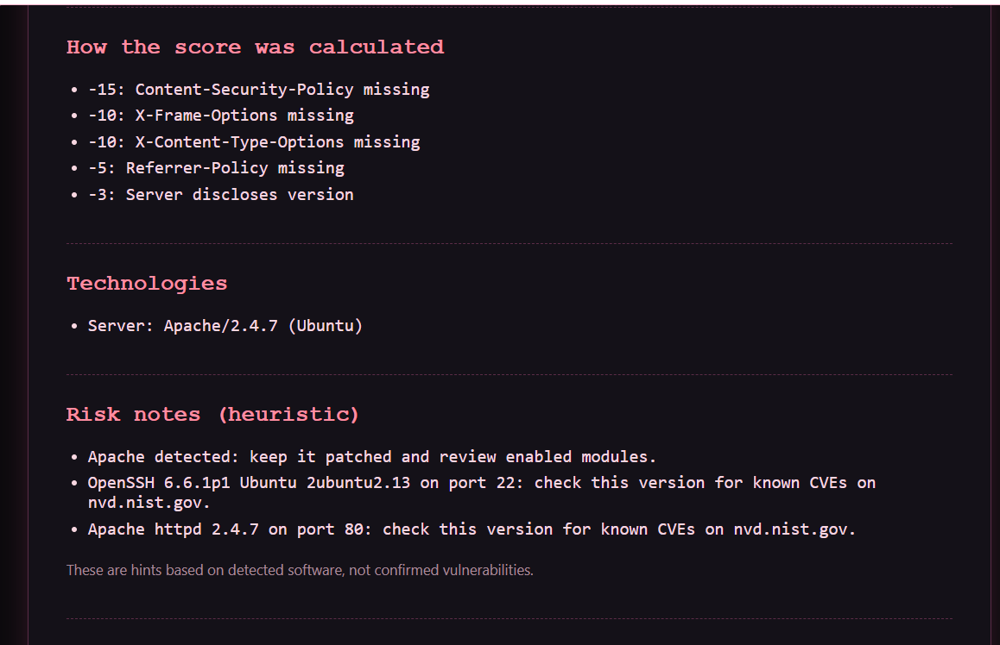

# WebRecon

A web-based reconnaissance and security-posture scanner. Enter a domain or IP
and WebRecon gathers DNS, WHOIS, subdomains, open ports, service versions,
HTTP security headers and exposed paths, then produces a graded report you can
download as PDF or JSON.

> **For authorized testing and education only.** Read [SECURITY.md](SECURITY.md) before use.

> **License:** All Rights Reserved. The code is viewable for evaluation only; see [LICENSE](LICENSE).





## Features

| Area                      | What it does                                                                                                 |
| ------------------------- | ------------------------------------------------------------------------------------------------------------ |
| DNS & WHOIS               | A, AAAA, MX, NS, CNAME and TXT records; registrar and expiry data with a fallback provider                   |
| Subdomains                | Certificate-transparency lookup (crt.sh) plus threaded wordlist brute force, with wildcard-DNS detection     |
| Ports & services          | nmap service/version detection (XML parsed), with a socket-scan fallback when nmap is missing                |
| HTTP security headers     | HSTS, CSP, X-Frame-Options, X-Content-Type-Options, Referrer-Policy, and server-banner disclosure            |
| Technology fingerprinting | Cloudflare, WordPress, React, Bootstrap, PHP and server software                                             |
| Exposed paths             | `.git/HEAD`, `.env`, `/admin/`, `robots.txt`, `sitemap.xml`; soft-404 / catch-all responses are filtered out |
| Email harvesting          | Public addresses found on the home, contact and about pages                                                  |
| Reporting                 | Security grade (A-F) with a transparent score breakdown, actionable fixes, PDF and JSON export               |

## Quick start

### Requirements

- Python 3.10+
- [nmap](https://nmap.org/download.html) on your `PATH` (optional but recommended)

### Run locally

```bash
git clone https://github.com/nooralshamasneh/webrecon.git
cd webrecon
python -m venv .venv
source .venv/bin/activate        # Windows: .venv\Scripts\activate
pip install -r requirements.txt
python app.py
```

Open http://127.0.0.1:8080.

### Run with Docker

```bash
docker build -t webrecon .
docker run --rm -p 127.0.0.1:8080:8080 webrecon
```

nmap is bundled in the image. Bind the port to `127.0.0.1` unless you add your own authentication.

## Configuration

| Variable                  | Default     | Purpose                                                      |
| ------------------------- | ----------- | ------------------------------------------------------------ |
| `WEBRECON_HOST`           | `127.0.0.1` | Interface to bind                                            |
| `WEBRECON_PORT`           | `8080`      | Port                                                         |
| `WEBRECON_DEBUG`          | off         | Set to `1` for Flask debug mode (local development only)     |
| `WEBRECON_MAX_CONCURRENT` | `2`         | Maximum simultaneous scans                                   |
| `WEBRECON_ALLOW_PRIVATE`  | off         | Set to `1` to allow private/loopback targets in your own lab |

## How the score works

Every scan starts at 100 and loses points for findings. The full breakdown is
shown in the UI and the PDF.

| Finding                                          | Points                      |
| ------------------------------------------------ | --------------------------- |
| Missing HSTS (HTTPS sites) / CSP                 | -15 each                    |
| Missing X-Frame-Options / X-Content-Type-Options | -10 each                    |
| Missing Referrer-Policy                          | -5                          |
| Server or X-Powered-By discloses a version       | -3 each                     |
| Exposed Telnet / SMB / RDP / Redis / MongoDB     | -25 / -20 / -20 / -20 / -20 |
| Exposed FTP / MySQL / PostgreSQL                 | -15 / -15 / -10             |
| Plaintext POP3 / IMAP                            | -5 each                     |
| Exposed `.git` or `.env`                         | -30 each                    |
| Reachable `/admin/`                              | -5                          |

Grades: A (90+), B (80+), C (70+), D (50+), F (below 50). The score is a
heuristic overview, not a substitute for a professional penetration test.

## Project structure

```
webrecon/
├── app.py                  # Flask app and export routes
├── webrecon_backend.py     # Scan orchestration, scoring, PDF report
├── modules/
│   ├── dns_lookup.py
│   ├── whois_lookup.py
│   ├── subdomain_finder.py
│   ├── port_scanner.py
│   ├── security_headers.py
│   └── email_extractor.py
├── templates/index.html
├── wordlists/subdomains.txt
├── Dockerfile
└── requirements.txt
```

## Known limitations

- Scans run synchronously; a full scan can take a few minutes.
- Results are kept in memory (last 20 scans) and are lost on restart.
- "Risk notes" are heuristics based on detected software, not confirmed CVEs.
- DNS-rebinding and redirects to internal addresses are not fully mitigated; do not expose the app to untrusted users.
- WHOIS falls back to a third-party API (hackertarget.com) when local lookup fails, which sends the queried domain to that service.

## Roadmap

- [ ] Background scans with live progress
- [ ] TLS checks (certificate expiry, weak protocols)
- [ ] SPF / DMARC / DKIM analysis
- [ ] CVE lookup through the NVD API
- [ ] Scan history and comparison (SQLite)

## License

Copyright (c) 2026 Noor Alshamasneh. All Rights Reserved.

The source code is publicly visible for viewing and evaluation only. Using,
copying, modifying or distributing it requires written permission. See [LICENSE](LICENSE).
